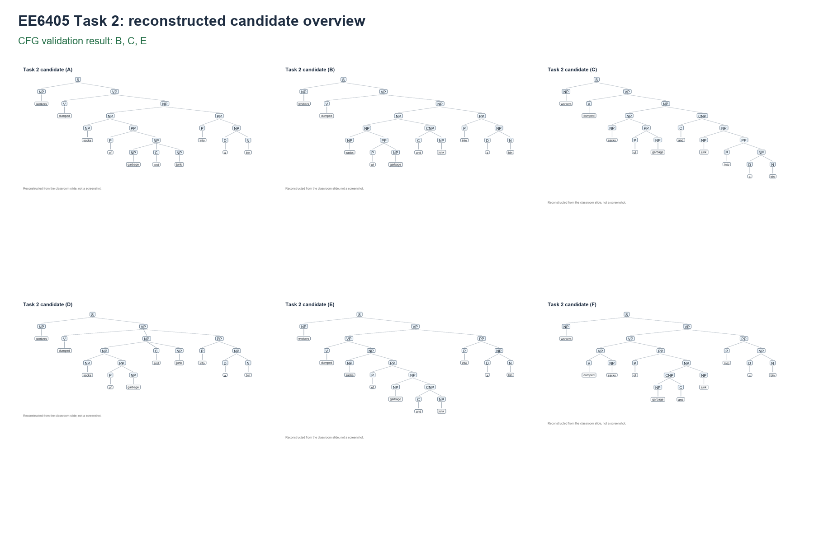

# EE6405 NLP Parsing Discussion: Reproducible CFG Analysis

This project reconstructs the six candidate trees from the EE6405 classroom discussion slide and checks them with a small, explicit context-free grammar (CFG). The computed Task 2 answer is **B, C, and E**.

## Important interpretation

The slide title says **“Dependency parsing”**, but the diagrams use phrase-structure labels such as `S`, `NP`, `VP`, `PP`, and `CNP`. They are therefore constituency trees, not conventional dependency trees. This repository follows the diagrams that are actually shown: it validates local phrase-structure productions.

## Results

The validator computes:

```text
Candidate A: INVALID
Candidate B: VALID
Candidate C: VALID
Candidate D: INVALID
Candidate E: VALID
Candidate F: INVALID
Computed valid candidates: B, C, E
Post-hoc reference check (B,C,E): PASS
```

The independent bounded chart parser generated **10** complete `S` parses for the token sequence and matched the reconstructed candidate trees **B, C, E**.

### Task 1

For the sentence “She took the lesson to heart”, the classroom choice is **B**. In the shown constituency analysis, the idiomatic `to heart` phrase is treated as a VP-level complement rather than as part of the object NP `the lesson`. This is a separate qualitative interpretation from the Task 2 CFG experiment.

## Grammar

The core structural rules are:

```text
S    -> NP VP
VP   -> V NP
VP   -> VP PP
NP   -> NP PP
NP   -> NP CNP
CNP  -> C NP
PP   -> P NP
NP   -> D N
```

The lexical rules cover the words in the slide. Crucially, the grammar allows right-branching coordination through `CNP -> C NP`; it does not allow flat `NP -> NP C NP`, reversed `CNP -> NP C`, or `NP -> CNP NP` structures.

This formal distinction also separates syntax from semantics:

- **C** is structurally valid even though attaching `into a bin` to the `junk` NP gives an odd interpretation.
- **D** can sound semantically plausible, but its shown tree is not licensed by the CFG (`VP -> V NP PP` and flat coordination are not allowed).

## Repository layout

```text
src/
  tree_model.py             immutable phrase-structure tree model
  parse_candidates.py       reconstructed A-F trees and Task 1 trees
  grammar.py                CFG rules and bottom-up local validation
  validate_trees.py         validation report and post-hoc reference check
  generate_valid_parses.py  bounded chart parser and candidate matching
  render_trees.py           PNG rendering from reconstructed trees
  run_all.py                reproducible runner with stdout/stderr logging
outputs/
  validation_results.txt/.json
  generated_parses.txt
  candidate_structures.txt/.json
  run_log.txt
figures/
  candidate_a.png ... candidate_f.png
  task2_candidates_overview.png
  task1_b.png
notes/
  detailed_analysis.md
```

The original classroom slide is copied locally as `original_question.png` for auditability, but it is intentionally excluded from GitHub by `.gitignore`. No classroom screenshot is required to run the code or inspect the reconstructed figures.

## Reproduce

From the project root:

```powershell
python src/run_all.py
```

The recorded run used the bundled workspace Python runtime because `ai_env` and conda were not available on PATH. No external NLP package is required; the experiment uses the Python standard library and Pillow for rendering. The exact preflight evidence and every child process's stdout/stderr are in `outputs/run_log.txt`.

## Figures



The individual reconstructed trees are available as `figures/candidate_a.png` through `figures/candidate_f.png`; the valid trees are `candidate_b.png`, `candidate_c.png`, and `candidate_e.png`.

## Limitations

This is a course-discussion reconstruction, not a complete English grammar or a dependency parser. The six trees were transcribed from the supplied raster slide, so the candidate structure is an auditable reconstruction rather than an original source file. The chart parser is intentionally bounded at 500 trees per chart cell.


